## Stage 1

- We've created a new blank project and called it `Lab01`
- We've spawned a NAT appliance by drag-and-dropping it to the canvas and renamed it to `LeNat9`
- We've spawned an OpenWrt 19.07.4 appliance by drag-and-dropping it to the canvas and renamed it to `Le*Router`
- We've connected `Le*Router`(eth1) to `LeNat9`(nat0) with a wire

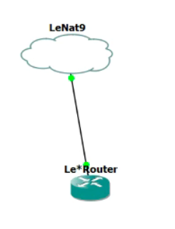


## Stage 2

- We've opened the terminal of our OpenWRT instance (Le*Router)
- We've opened vi editor and modified `/etc/config/firewall` by adding following redirect rule to the end of the file:
```
config rule
  option name       'Allow SSH'
  option src        'wan'
  option proto      'tcp'
  option dest_port  '922'
  option target     'ACCEPT'
  option enabled    '1'
```
- We've restarted the Firewall by running `/etc/init.d/firewall restart`
- We've installed `openssh-server` package on our router (aka `Le*Router`) by running:
```shell
$ opkg update                 # Fetch all available packages
$ opkg install openssh-server # Install openssh-server
```
- We've modified `/etc/ssh/sshd_config` by changing the port
- We've modified the password of root on OPENWRT Machine with SPACE
```shell
$ passwd root
```

- We've generated a new SSH KEYPAIR with ED25519 format.

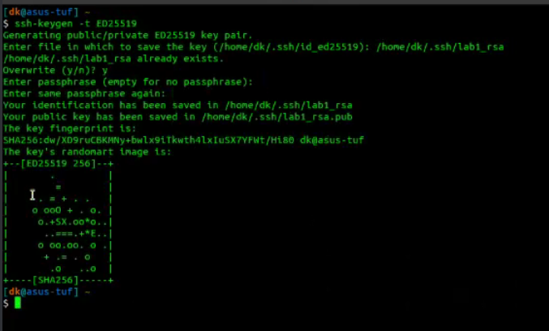

- The Ed25519 (introduced to OpenSSH version 6.5) uses elliptic curve cryptography that offers a better security with faster performance compared to RSA or ECDSA.

- Today, the RSA is the most widely used public-key algorithm for SSH key. Compared to Ed25519, it’s slower and even considered a security risk if it’s generated with the key smaller than 2048-bit length.

- A Ed25519 public-key is compact, only contains 68 characters, compared to RSA 3072 that has 544 characters. Generating the key is also almost as fast as the signing process. It’s fast to perform batch signature verification with Ed25519 and built to be collision resilience.

## Stage 3
- We've installed `luci` by running on our OpenWRT machine
```shell
$ opkg install luci
```
- We've modified SSH server config (`/etc/ssh/sshd_config`) by adding following lines to the end of the file:
```sshd_config
PermitRootLogin yes # Grant access to the SSH server as an user from `root` group
Port 922            # Open the ssh sever on port 922
```

- We've setup port forwarding from port 80 on our OpenWRT machine to port 988 on our host machine with SSH by running
```shell
$ sudo ssh -L 988:127.0.0.1:80 root@192.168.122.251 -p 922
```
- We've used ssh tunnel but we can also change the firewall of OpenWrt 

- We've managed to have access to LuCi on our host machine with SSH Tunnel 

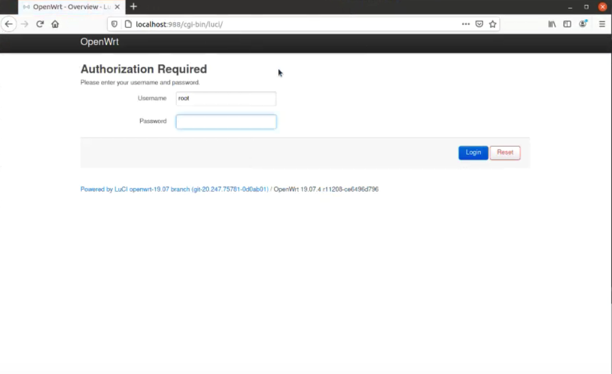

## Stage 4

- We've configured `Le*Router` to use a class A ip address:

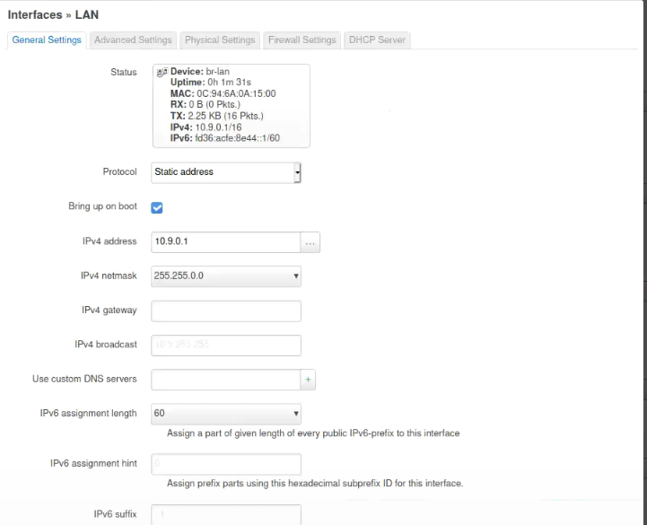

- Here is the list of our reserved ips:
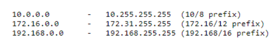\
And so the prefixes are : /8, /12, /16

- We've connected the Alpine linux appliance called `LeWebServer` to the lan
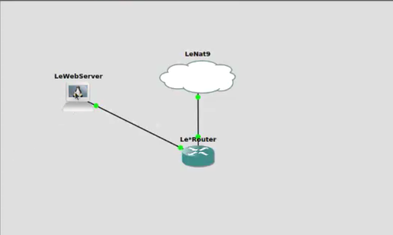

- We've de-commented DHCP in the WebSever configuration 
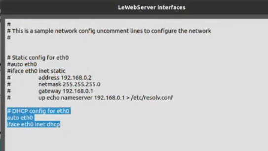


## Stage 5
- We've installed nginx on `LeWebServer` by running:
```shell
$ apk update    # Fetch apk repository with latest data
$ apk add nginx # Download and install nginx on the machine
```

- We've configured NGINX by editing `/etc/nginx/conf.d/default.conf` as follows:
```nginx
server {
  listen 980;
  index index.html;
  root /var/www/lab1.GROUP_9;  
}
```

- We've created a folder in `/var/www` called `lab1.GROUP_9` and made there a HTML file with following code:

```html
<!doctype html>
<html lang=”en”>
<head>
  <meta charset=”utf-8”>
  <title>The HTML5 Herald</title>
  <meta name=”description” content=”The HTML5 Herald”>
<meta name=”author” content=”SitePoint”>
</head>
<body>
  <a href=”./pocorgtfo01.pdf”>issue 1</a>
</body>
</html>
```

- We've created a fake `nginx.pid` in order to have nginx working, since Alpine Linux does not include service management utils by default, by running:
```shell
$ mkdir -p /run/nginx                 # create a folder in /run for nginx
$ echo "12345" > /run/nginx/nginx.pid # Create a file in /run/nginx called nginx.pid with a random sequence of number to simulate real PID, with minimal risk of collisions
```


- We've started the server by running `nginx`

- The two commands to download the file in the served nginx folder are:

```shell
$ curl -L '<url>' --output '<path_to_file>'
$ wget -O '<path_to_file>' '<url>'
```

- Now we can see that we can download the pdf via browser on our host machine 
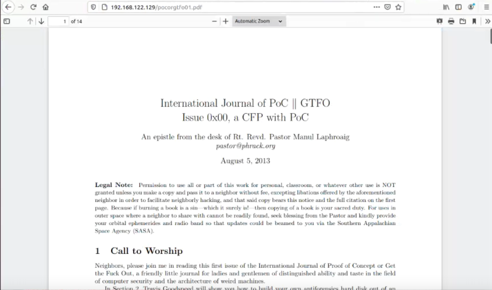

- We can access to this site because we've configured port forwarding on our router 
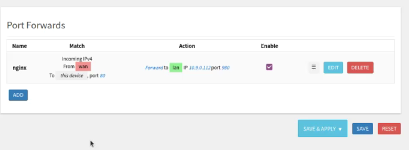


## Stage 6
- We added a switch between LeWebServer and Le*Router 
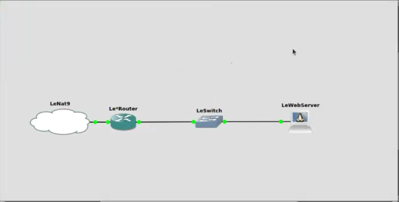

- We added a static ip to LeWebServer 
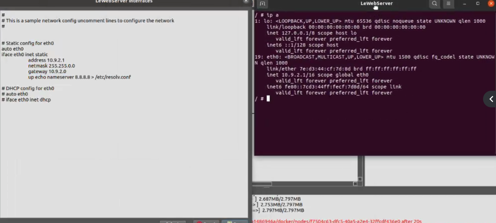

## Stage 7

- We've created two subnets:
  + `Subnet1` on `10.9.1.0/16`
  + `Subnet2` on `10.9.2.0/16`.

- We've added another Alpine Linux machine called `L'AlpineLinux` and connected it to the network with these settings:
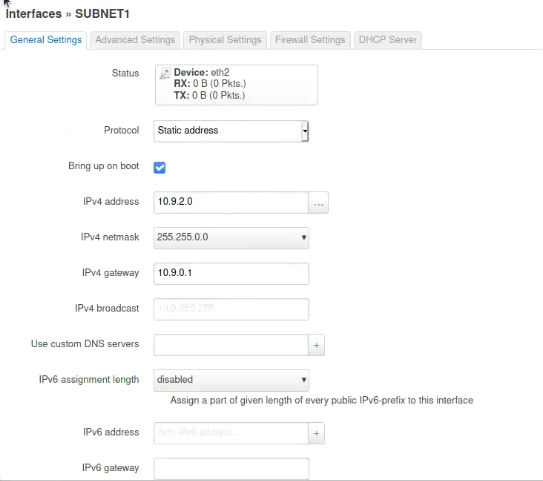

- Then we've downloaded the file by running:
```shell
$ wget 10.9.2.1:980/pocorgtfo01.pdf
```
here are the results:
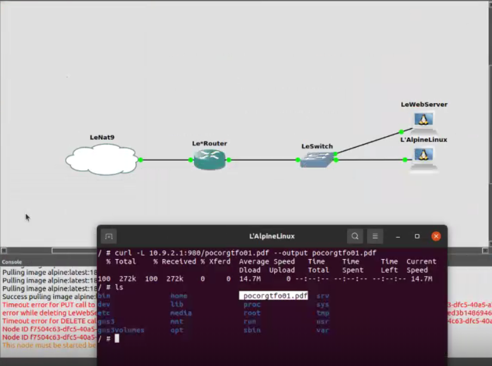

## Stage 8

- HTTP ➜ RFCS : 1945, 2068, 2616, 7230 to 7237 and 7540.\
  https://tools.ietf.org/html/rfc2616 


- SSH ➜ RFC: 4253\
  https://tools.ietf.org/html/rfc4253


- IP ➜ RFC: 791\
  https://tools.ietf.org/html/rfc791

- Ethernet ➜ RFC: 894\
  https://tools.ietf.org/html/rfc894.
