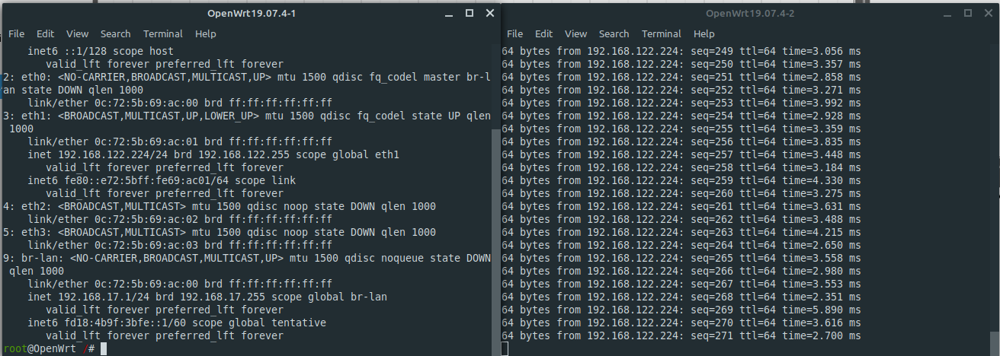

--- 
title: ”B2 - Lab 3 - GROUP 17”
author:
- Dmitrii KOPENKIN

output:
  pdf_document: default
--- 

### Stage 0 - Setup
To create a new project in gns3, simply open it, then give a name to your project. Click ok.

For this lab we'll need ethernet switches, alpine linux, and OpenWRT.
- Ethernet switches are already added in gns3 when installing
- To add alpine linux and OpenWrt appliance:
- click on "new template"
- Install an appliance form the GNS3 Server > next
- Select the appliance you want to add > install

### Stage 1 - Basic LAN
Create a NAT node called lab-17
Create OpenWRT node
link eth0 of NAT to the eth1 of th router
Configure subnet `192.168.17.1/24`  by oppening `/etc/config/network` setting following rules:
```config
config interface 'lan'
  option type 'bridge'
  option ifname 'eth0'
  option proto 'static'
  option ipaddr '192.168.17.1'
  option netmask '255.255.255.0'
  option ipassign '60'
```
and **restarting** the network service by running `/etc/init.d/network restart`

### Stage 2 - Remote LAN
Create a NAT node called company-17

Create OpenWRT node

Link eth0 of NAT to the eth1 of th router

Configure subnet `192.168.18.1/24`  by oppening `/etc/config/network` setting following rules:
```config
config interface 'lan'
  option type 'bridge'
  option ifname 'eth0'
  option proto 'static'
  option ipaddr '192.168.18.1'
  option netmask '255.255.255.0'
  option ipassign '60'
```
and restarting the network service by running `/etc/init.d/network restart`

Both machines can now ping each other


### Stage 3 - VPN mesh
Install wireguard on both openwrt machines by running `opkg install wireguard wireguard-tools`

Install wireguard on client alpine machines by running `apk add wireguard-tools`

Generate Public/Private keypair on both routers by rinning `wg genkey | tee wg.key | wg pubkey > wg.pub`

Add a new network card with wireguard preset by changing `/etc/config/network` and adding the following:
```config
config interface 'vpn'
  option type 'wireguard'
  option private_key '<private_key>'
```

### Stage 4 - Remote access


### Stage 5 - Some theory

#### Part 1: VPN & leaks
##### VPN leak: describe what a vpn leak is. Identify potential leaks (present and non present) in the setup the current setup, and explain how we could fix them.
When you are connected to a server, your computer's operating system will usually use DNS servers by default, rather than those that can be anonymous and more secure. The name given to this is a DNS leak.

#### Part 2: DNS

##### Explain briefly what a DNS do.
DNS - Domain Name Service is used to map uri (Unversal ressource identifiers) to IP addresses (8.8.8.8 -> https://dns.google/)

##### Find 3 DNS providers that you could use at home.
- OpenDNS (https://www.opendns.com/)
- Cloudflare (https://www.cloudflare.com/)
- Google Public DNS (https://dns.google/)
- 

##### Find and explain what is a root dns and list them.
A root name server is responsible for fundamental functions when it comes to translating domain names into IP addresses: it answers client requests in the domain name system’s root zone (the root zone marks the largest layer in the DNS’ name space). 
```
Hostname        	IP address IPv4 / IPv6	            Organization
a.root-servers.net	198.41.0.4,   2001:503:ba3e::2:30	VeriSign, Inc.
b.root-servers.net	199.9.14.201, 2001:500:200::b	    University of Southern California (ISI)
c.root-servers.net	192.33.4.12,  2001:500:2::c	        Cogent Communications
```

##### Describe how you could use a DNS in the current setup to disable ads, find at least one open source suite that does that.
You can use a dns that maps known ad url's to localhost
OpenDNS does ad blocking and is open-source